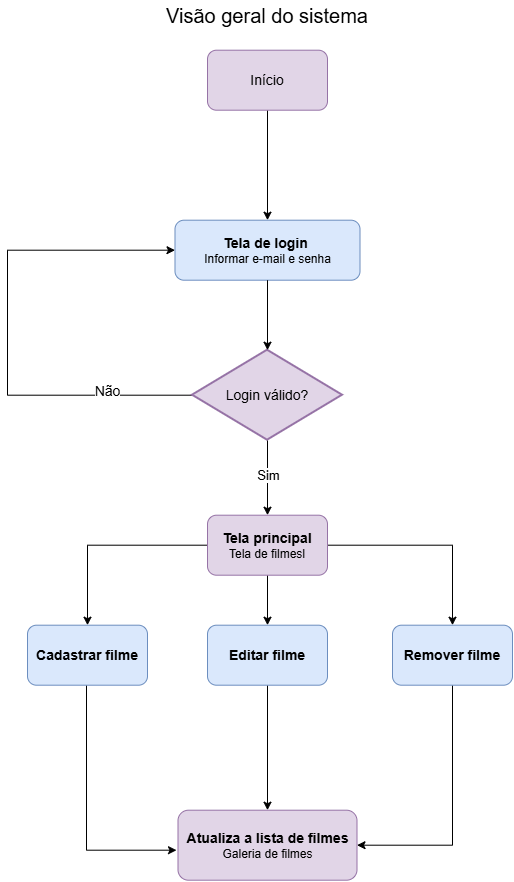
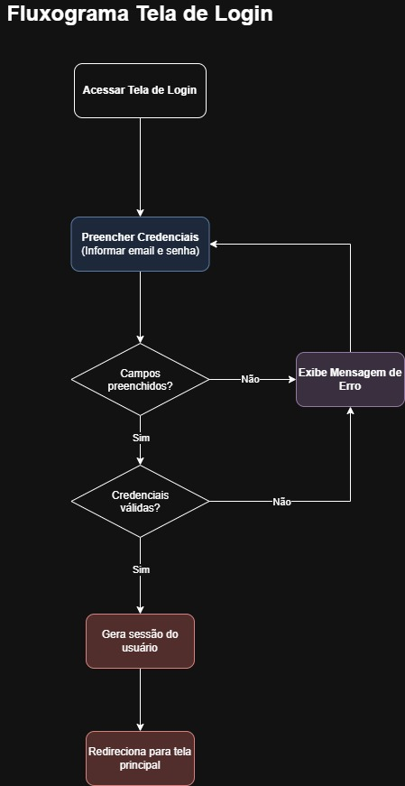

# Documento de requisitos do projeto
**Nome do projeto:** Catálogo de filmes

**Equipe de desenvolvimento:** Sophia Nader

## Visão Geral do Sistema (Escopo)
O objetivo do projeto é elaborar um catálogo de filmes acessível e eficiente, permitindo ao usuário registrar informações sobre diferentes filmes, como título, gênero, ano de lançamento, duração e sinopse, além de possibilitar a organização e pesquisa dos filmes catalogados de forma simples e rápida, oferecendo uma experiência intuitiva para facilitar o acesso às informações.

## Requisitos Funcionais (RF) 
**RF01:** Cadastro - O sistema deve gerenciar o cadastro do cliente, contendo as seguintes informações: 

 - Nome completo;
 - Telefone;
 - E-mail;
 - Senha;

 **RF02:** O sistema deve permitir que o cliente faça o registro dos filmes que deseja, catalogando os tópicos:
 
 - Nome do filme (obrigatório);
 - Imagem de Capa;
 - Gênero;
 - Ano de lançamento;
 - Nota/Avaliação;

 **RF03** Visualização dos arquivos - O sistema deve permitir que o cliente visualize os arquivos de maneira individual e em conjunto, como uma estante.

 **RF04** Edição das resenhas - O sistema deve permitir que o cliente modifique os arquivos depois de prontos, caso necessário.

 **RF05** Apagar arquivos -  O sistema deve permitir que o cliente exclua os arquivos que desejar.

 **RF06** Arquivo PDF - O sistema deve possibilitar a geração de um arquivo PDF a cada filme catalogado, para facilitar o compartilhamento das resenhas.

## Requisitos Não Funcionais (RNF)
**RNF01** Gerenciamento de dados - O sistema deve armazenar as informações cadastradas pelo usuário, garantindo a segurança necessária.

**RNF02** Tempo de carregamento - O sistema deve possuir um tempo de carregamento inferior a 2 segundos.

**RNF03** Acessibilidade - O sistema deve bloquear o acesso de pessoas que não sejam o cliente.

**RNF04** Interface - O sistemsa deve possuir uma interface simples e acessível.

**RNF05** Armazenamento de Imagens - O sistema deve armazenar todas as imagens que foram cadastradas pelo usuário.

## Visão Geral do Projeto (Diagrama)
 

## Diagrama Página de Login

